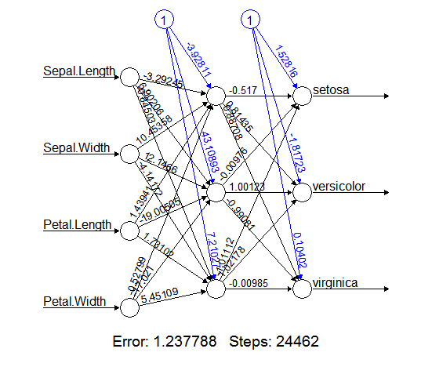

<style>
.title-slide {
  background-color: #DB598A; /* #EDE0CF; ; #CA9F9D*/
}

.title-slide hgroup > h1{
 font-family: 'Oswald', 'Helvetica', sanserif; 
}

.title-slide hgroup > h1, 
.title-slide hgroup > h2,
.title-slide hgroup > p {
  color: #FFFFFF ;  
}
</style>

```{r setup, include=FALSE}
library(knitr)
opts_chunk$set(echo = FALSE)
opts_chunk$set(warning=FALSE, message=FALSE)
opts_chunk$set(tidy.opts=list(width.cutoff=58),tidy=TRUE)
```
```

## Slide and Sample Data

<https://github.com/vkrit/chula_datamining>.


## Agenda

1. Overview and data visualization
2. Data Preparation
3. Predictive Data Mining
    - Decision Tree
    - K-Nearest Neighbor
    - Naive Bayes Classifier
    - Neural Network

## Overview
Predictive Data Mining : two phases of processing

1. Training Phase : 
    Create a model from traning data
2. Predicting phase (Testing) : 
    Deploy the model to production and use that to predict the future outcome
        
## Data
Iris Data Set from UCI Machine Learning Repository <https://archive.ics.uci.edu/ml/datasets/iris>


## Iris Data - Atrribute Information

+--------+----------------------+
| Column | Data Description     |
+========+======================+
| 1      | Sepal Length in cm   |
+--------+----------------------+
| 2      | Sepal Width in cm    |
+--------+----------------------+
| 3      | Petal Length in cm   |
+--------+----------------------+
| 4      | Petal Width in cm    |
+--------+----------------------+
| 5      | Classes              |
+--------+----------------------+

## Iris Data - Class (Label)

+--------+----------------------+
| Column | Data                 |
+--------+----------------------+
| Class  | - Iris Setosa        |
|        | - Iris Versicolor    |
|        | - Iris Verginica     |
+--------+----------------------+

## Getting Data

```{r echo = TRUE}
iris <- read.csv("iris.data.csv", header=TRUE)
summary(iris)
```

## Exploring Data

```{r iris, echo=TRUE}
nrow(iris)
table(iris$Species)
```

## Data Visualization

- Visualizing existing data is a very useful way to come up with ideas about what features should be included.
- "Dataframe" in R is a common way where data samples are organized in a tabular structure.

## Plot data according to their types
Let's start with numberic type first

```{r, echo=TRUE, fig.width=8, fig.height=3}
# Plot the histogram
hist(iris$Sepal.Length, breaks=10, prob=T)
# Plot the density curve
lines(density(iris$Sepal.Length))
```

##
Next data in categorical type

```{r, echo=TRUE, fig.width=8, fig.height=5}
categories <- table(iris$Species)
barplot(categories, col=c('red','white','blue'))
```

## 
Let cross data between numeric and categorical

```{r, echo=TRUE, fig.width=8, fig.height=5}
boxplot(Sepal.Length ~ Species, data=iris, col=c('pink'))
```

## 
Next, let do correlation in charts using "pairs"

```{r, echo=TRUE}
# Scatter plot for all pairs
pairs(iris[ , c(1,2,3,4)])
```

##
Compute the correlation matrix
```{r, echo=TRUE}
# Compute the correlation matrix
cor(iris[ , c(1,2,3,4)])
```

##
Draw regression line for suspect attribute to see relationship

```{r, echo=TRUE}
plot(Petal.Width~Sepal.Length, data=iris)
model <- lm(Petal.Width~Sepal.Length, data=iris)
abline(model)
model2 <- lowess(iris$Petal.Width~iris$Sepal.Length)
lines(model2, col="red")
```

## Preparing Training Data
At this step, the purpose is to transform the raw data in a form that can fit into the
data mining model.

    - Data sampling
    - Data validation and handle missing data
    - Normalize numeric value into a uniform range
    - Compute aggregated value (a special case is to compute frequency counts)
    - Expand categorical field to binary fields
    - Discretize numeric value into categories
    - Create derived fields from existing fields
    - Reduce dimensionality
    - Power and Log transformation

## Data Sampling

```{r, echo=TRUE}
# Select 10 records out from iris with replacement
index <- sample(1:nrow(iris), 10, replace=T)
index
```

##

```{r, echo=TRUE}
# Subset iris to irissample from index
irissample <- iris[index,]
irissample
```

## Impute missing data
- Discard the whole record
- Infer missing data with Average or Median

```{r, echo=TRUE}
# Create some missing data
irissample[10,1]<-NA
irissample
```

##

```{r, echo=TRUE}
# Fix using Mean
library(e1071)
fixiris1 <- impute(irissample[,1:4], what='mean')
fixiris1
```

##

```{r, echo=TRUE}
# Fix using Median
library(e1071)
fixiris2 <- impute(irissample[,1:4], what='median')
fixiris2
```

## Normalize numeric value

```{r, echo=TRUE}
# Scale the colums
# x-mean(x)/standard deviation
scaleiris <- scale(iris[ , 1:4])
head(scaleiris)
```

## Reduce dimension
There are two ways to reduce the number of input
attributes.

    1. Removing irrelevant input variables.
    2. Removing redundant input variables.
    
##
```{r, echo=TRUE}
# Use iris data set
cor(iris[, -5])
# Compute PCA
# Notice that PC1 and PC2 covers most variation
pca <- prcomp(iris[,-5], scale=T)
summary(pca)
```

##
```{r, echo=TRUE}
# Plot PCA
plot(pca)
```

##
```{r, echo=TRUE}
pca$rotation
```

##
```{r, echo=TRUE}
predict(pca)[1:2,]
biplot(pca)
```

## Add derived attributes
```{r, echo=TRUE}
iris2 <- transform(iris, ratio=round(Sepal.Length/Sepal.Width, 2))
head(iris2)
```

## Discretize numeric value into categories
```{r, echo=TRUE}
# Equal width cuts
segments = 10
maxL <- max(iris$Petal.Length)
minL <- min(iris$Petal.Length)
theBreaks <- seq(minL, maxL, by=(maxL-minL)/segments)
cutPetalLength <- cut(iris$Petal.Length, breaks=theBreaks, include.lowest = T)
newdata <- data.frame(origin.Petal.Len=iris$Petal.Length, cut.Petal.Len=cutPetalLength)
head(newdata)
```

##
```{r, echo=TRUE}
# Constant frequency / height
myBreaks <- quantile(iris$Petal.Length, probs=seq(0,1,1/segments))
cutPetalLength2 <- cut(iris$Petal.Length, breaks = myBreaks, include.lowest = T)
newdata2 <- data.frame(orig.Petal.Lens = iris$Petal.Length, cut.Petal.Len = cutPetalLength2)
head(newdata2)
```

## Binarize categorical attributes
```{r, echo=TRUE}
cat <- levels(iris$Species)
binarize <- function(x) {return(iris$Species == x)}
newcols <- sapply(cat, binarize)
colnames(newcols) <- cat
data <- cbind(iris[, c('Species')], newcols)
```

## Binarize categorical attributes (cont)
```{r, echo=TRUE}
data[45:55,]
```

# Data Mining Techniques

## Iris Data Preparation
```{r, echo=TRUE}
# sample iris into 2 sets (training, testing) with 70%/30%
set.seed(1234)
ind <- sample(2, nrow(iris), replace=TRUE, prob=c(0.7,0.3))
trainData <- iris[ind==1,]
testData <- iris[ind==2,]
```
## Decision Tree

Libray name -> party

Function name -> ctree

Installation

install.packages("party")

## Decision Tree - Create Model
```{r, echo=TRUE}
library(party)
myFormula <- Species ~ Sepal.Length + Sepal.Width + Petal.Length + Petal.Width
iris_ctree <- ctree(myFormula, data=trainData)
# Check the prediction
table(predict(iris_ctree), trainData$Species)
```

##
```{r, echo=TRUE}
print(iris_ctree)
```

##
```{r, echo=TRUE}
plot(iris_ctree)
```

##
```{r, echo=TRUE}
plot(iris_ctree, type="simple")
```

## Decision Tree - Prediction 
```{r, echo=TRUE}
# Predict on test data
testPred <- predict(iris_ctree, newdata = testData)
table(testPred, testData$Species)
```

## K-Nearest Neighbor Classfication (k-NN)

Library -> class

Function -> knn

Installation

install.packages("class")

## K-NN
```{r, echo=TRUE}
library(class)
train_input <- as.matrix(trainData[,-5])
train_output <- as.vector(trainData[,5])
test_input <- as.matrix(testData[,-5])
prediction <- knn(train_input, test_input, train_output, k=5)
table(prediction, testData$Species)
```

## Naive Bayes Classifier

Library --> e1071

Function --> naiveBayes

Installation

install.packages("e1071")

## Naive Bayes
```{r, echo=TRUE}
library(e1071)
# can handle both categorical and numeric input
# but output must be categorical
model <- naiveBayes(Species ~ . , data=trainData)
prediction <- predict(model, testData[,-5])
table(prediction, testData[,5])
```

## Neural Network

Library --> neuralnet

Function --> neuralnet

Installation

install.packages('neuralnet')

## Neural Network
```{r, echo=TRUE}
library(neuralnet)
nnet_trainData <- trainData
#Binarize the categorical output
nnet_trainData <- cbind(nnet_trainData, trainData$Species == 'Iris-setosa')
nnet_trainData <- cbind(nnet_trainData, trainData$Species == 'Iris-versicolor')
nnet_trainData <- cbind(nnet_trainData, trainData$Species == 'Iris-virginica')
names(nnet_trainData)[6] <- 'setosa'
names(nnet_trainData)[7] <- 'versicolor'
names(nnet_trainData)[8] <- 'virginica'
nn <- neuralnet(setosa+versicolor+virginica ~ Sepal.Length+Sepal.Width+Petal.Length+Petal.Width, data= nnet_trainData, hidden=c(3))
```

## Neural Network - Plot Model

```{r, echo=TRUE}
plot(nn)
```


## Neural Network - Prediction

```{r, echo=TRUE}
mypredict <- compute(nn, testData[-5])$net.result
# put multiple binary output to categorical output
maxidx <- function(arr) { return(which(arr==max(arr)))}
idx <- apply(mypredict, c(1), maxidx)
prediction <- c('Iris-setosa','Iris-versicolor','Iris-virginica')[idx]
table(prediction, testData$Species)
```

# End of Part 1 
